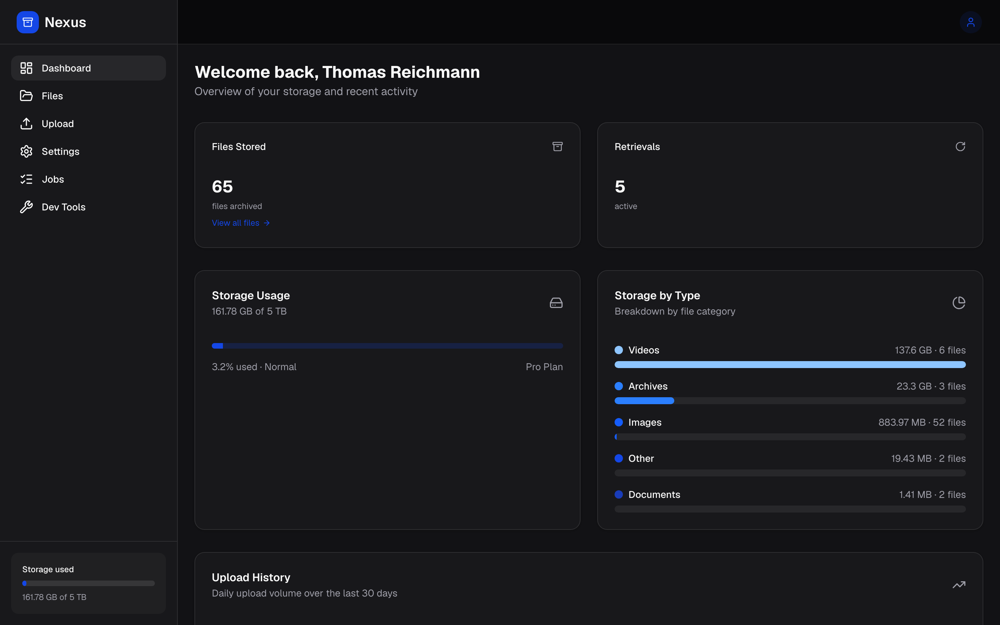
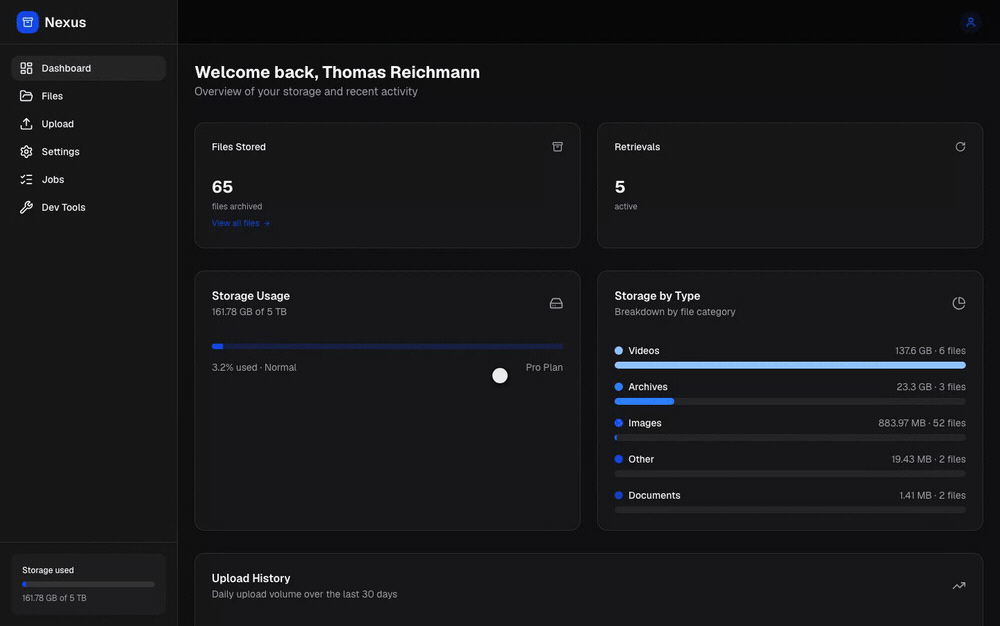
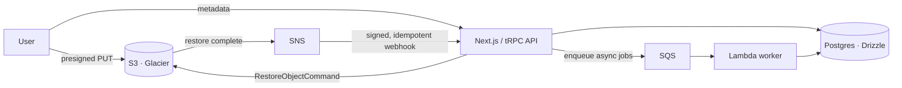
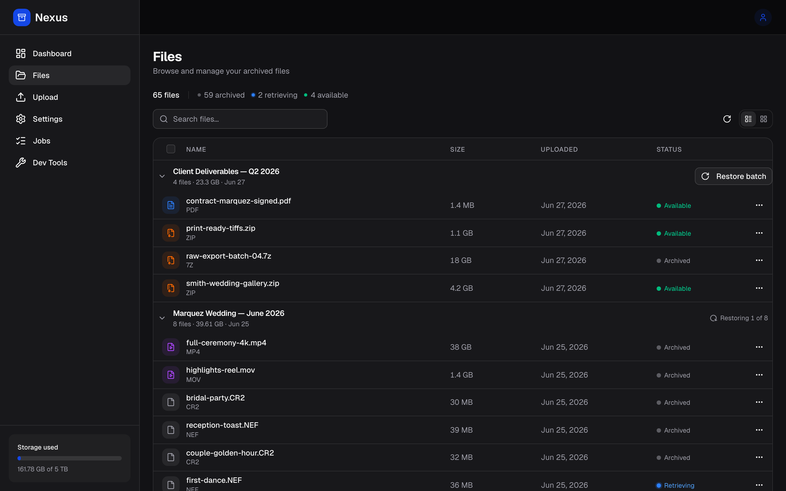
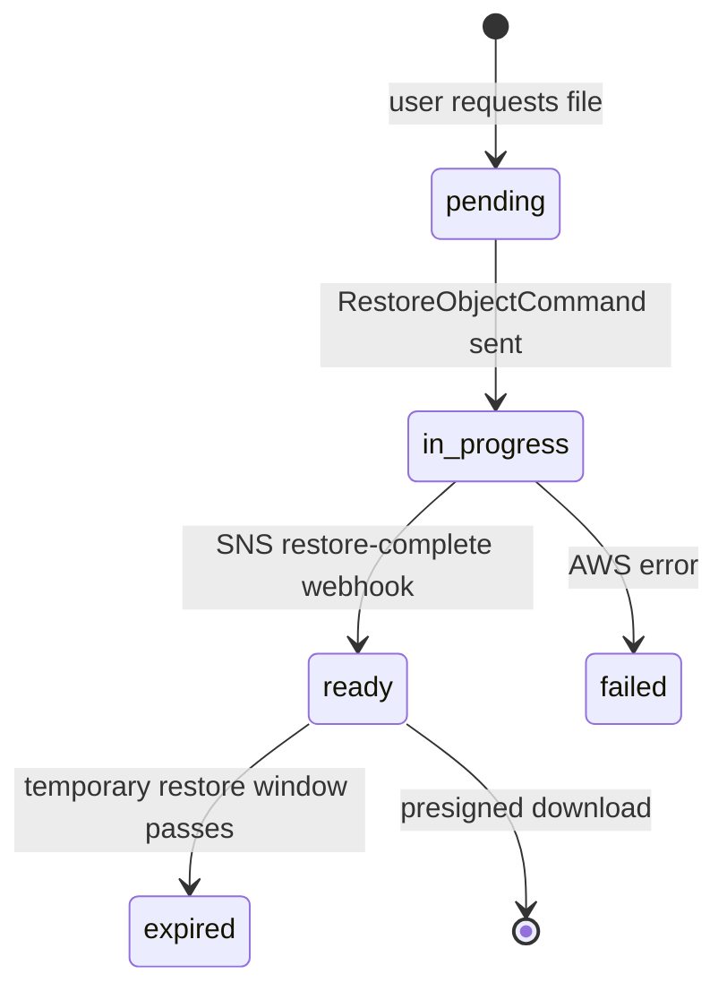

<div align="center">

# Nexus

**Deep storage made simple — "Dropbox for archival."**

Nexus puts the files you want to keep but rarely touch (photo libraries, finished projects, raw footage) into Amazon S3 Glacier, so you pay archival prices for cold data instead of hot-storage prices for instant access you don't need.


[Live demo](https://nexus.thomasar.dev) · [Architecture](docs/architecture/_index.md) · [Decisions (ADRs)](docs/decisions/_index.md) · [Getting started](docs/guides/getting-started.md)

[](https://nexus.thomasar.dev)

<sub>The dashboard: storage overview, file-type breakdown, and active Glacier retrievals.</sub>

</div>

## Why I built this

My mother is a photographer with a decade of shoots living on a closet full of external drives. One of them started failing, and a corruption scare nearly took a wedding's worth of photos with it. The right home for that data is cold cloud storage — it's cheap and durable — but the consumer tools are built around instant access you pay for every month and never use. Nexus is the archival-first version: store cold, pay cold, and accept a wait when you actually need a file back. Photographers and anyone with large, rarely-touched archives are the people it's for.

## How it works

Glacier is cheap because retrieval isn't instant. Restoring an object takes minutes to hours. The interesting engineering in Nexus is making that asynchronous restore feel like a normal download: you request a file, the system kicks off an S3 restore, and you get a clear status until it's ready.

<div align="center">



<sub>A walkthrough: storage overview, archived shoots grouped by upload batch, multi-select with bulk restore, then upload.</sub>

</div>



Upload is a presigned `PUT` (or multipart for large files) straight to S3, with file metadata tracked in Postgres. **Every uploaded file is stored in Glacier by default.** The storage layer and the data model support any S3 tier (`standard` / `glacier` / `deep_archive`), but the product sends everything to Glacier today and will for the foreseeable future. Files are grouped by upload batch (a photographer's natural unit is "a shoot"), and a restore in flight shows as `Retrieving`:

<div align="center">



</div>

Retrieval runs through a state machine:



A download URL is only ever issued once the retrieval is `ready`. The SNS webhook that drives the `ready` transition is signature-verified and idempotent on the message ID, so AWS retries can't double-process. Retrieval speed is a tier the user picks: expedited (minutes), standard (3–5 hours), or bulk (cheapest, up to ~12 hours).

## Engineering highlights

- **Event-driven Glacier restore** — a `pending → in_progress → ready → expired` state machine ([`server/services/s3-restore.ts`](apps/web/server/services/s3-restore.ts)) driven by a signature-verified, message-ID-idempotent SNS webhook ([`app/api/webhooks/s3-restore/route.ts`](apps/web/app/api/webhooks/s3-restore/route.ts)). Presigned download only when `ready`.
- **Idempotent billing & event webhooks** — Stripe and SNS events are deduped through a shared `webhooks` table. Signature verification, unique-violation handling for redelivery races, and terminal-state guards keep replayed or out-of-order events from double-processing. Prices resolve by Stripe metadata, so the same code runs in test and live ([`lib/stripe/`](apps/web/lib/stripe)).
- **A real E2E coverage gate** — [`apps/web/scripts/e2e-coverage.ts`](apps/web/scripts/e2e-coverage.ts) derives routes from the `app/` tree, so "100% covered" can't be hollow. It fails the build on a page that's missing from the manifest, a typo'd `@page`/`@uc` tag, or a validate-only case with no `manual:` reason.
- **Published tooling** — [`packages/trpc-devtools`](packages/trpc-devtools) is a standalone tRPC devtools panel shipped to npm (MIT, with build provenance) and consumed by the web app.
- **A typed monorepo** — [`@nexus/db`](packages/db) is the single source of truth for schema, migrations, and repositories. It also exports typed test-seeding helpers (`@nexus/db/test-db`) shared by unit and E2E tests.

## Tech stack

| Layer     | Technology                            |
| --------- | ------------------------------------- |
| Framework | Next.js 16, React 19, TypeScript      |
| API       | tRPC v11 (end-to-end typesafe)        |
| Database  | Supabase (PostgreSQL), Drizzle ORM    |
| Storage   | AWS S3 Glacier (presigned uploads)    |
| Async     | AWS SQS + Lambda worker, SNS webhooks |
| Auth      | BetterAuth                            |
| Payments  | Stripe (subscriptions + webhooks)     |
| UI        | Tailwind, shadcn/ui                   |
| Monorepo  | pnpm workspaces, Turborepo            |
| Testing   | Vitest, Playwright                    |

## Project structure

```
nexus/
├── apps/
│   ├── web/                 # Next.js 16 app — App Router UI, tRPC API, S3 + Stripe
│   │   ├── app/             # Routes, server actions, webhook handlers
│   │   ├── server/          # tRPC routers + services (restore state machine, billing)
│   │   ├── lib/             # storage (S3/Glacier), env validation, Stripe, SNS
│   │   ├── components/      # UI (Tailwind + shadcn/ui)
│   │   └── e2e/             # Playwright suites + coverage gate
│   └── worker/              # AWS Lambda SQS consumer — typed async-job registry
├── packages/
│   ├── db/                  # @nexus/db — Drizzle schema, migrations, repositories, test-db
│   └── trpc-devtools/       # Published tRPC devtools panel (npm)
├── docs/                    # Obsidian vault — architecture, ADRs, guides, planning
└── scripts/                 # Repo automation (check, coverage summaries)
```

## Getting started

### Prerequisites

- Node.js 24 (`.nvmrc` pins the version)
- pnpm 10.26+
- A Supabase project (PostgreSQL)
- An AWS account with an S3 bucket, plus SQS/SNS for the async flow
- A Stripe account (test mode is fine)

### Quick start

```bash
git clone <repo-url> && cd nexus
pnpm install

# Configure environment (see Environment variables below)
cp apps/web/.env.example apps/web/.env.local   # then fill in real values

pnpm -F db db:migrate                            # apply database migrations
pnpm dev                                         # http://localhost:3000
```

> Maintainers with Vercel access can skip the copy step and run `pnpm env:pull` to fetch `apps/web/.env.local` directly.

## Environment variables

Validated at startup by [`apps/web/lib/env/schema.ts`](apps/web/lib/env/schema.ts) (the canonical list) and imported type-safely via `@/lib/env`. A missing or malformed variable fails the build, not a request.

| Category | Variables                                                                                |
| -------- | ---------------------------------------------------------------------------------------- |
| Database | `DATABASE_URL`                                                                           |
| Auth     | `BETTER_AUTH_SECRET` (32+ chars)                                                         |
| AWS      | `AWS_ACCESS_KEY_ID`, `AWS_SECRET_ACCESS_KEY`, `AWS_REGION`, `S3_BUCKET`, `SQS_QUEUE_URL` |
| Stripe   | `STRIPE_SECRET_KEY`, `STRIPE_WEBHOOK_SECRET`                                             |
| Email    | `RESEND_API_KEY`, `RESEND_FROM_EMAIL`                                                    |
| Public   | `NEXT_PUBLIC_APP_URL`                                                                    |

## Commands

```bash
pnpm dev          # Start the web app
pnpm check        # Lint + build + test (run before committing)
pnpm build        # Build all workspaces
pnpm lint         # ESLint
pnpm test         # Unit + integration (Vitest)
pnpm typecheck    # TypeScript, no emit
pnpm test:e2e     # Full Playwright suite
```

Database commands run from the `db` package:

```bash
pnpm -F db db:generate        # Generate a migration from schema changes
pnpm -F db db:migrate         # Apply pending migrations
pnpm -F db db:studio          # Open Drizzle Studio
pnpm -F db db:custom <name>   # Empty migration for RLS / SQL functions
```

## Testing & CI

- **Unit & integration** — Vitest across `web`, `db`, and `worker` (~430 cases).
- **End-to-end** — a 4-tier Playwright suite (`smoke` / `flows` / `admin` / `validate`). Pick the smallest tier that covers a change:
    ```bash
    pnpm -F web test:e2e:smoke    # page renders + light flows (run after any UI change)
    pnpm -F web test:e2e:flows    # file browser + upload interactions
    pnpm -F web test:e2e:admin    # admin jobs / files / dev-tools
    ```
    Test data is seeded through typed back-door helpers (`@nexus/db/test-db`). Only the behavior under test goes through the UI.
- **Coverage gate** — `pnpm -F web e2e:coverage --check` fails CI when a page or use-case ships without a test (see the highlights above).

CI ([`.github/workflows/`](.github/workflows)) runs lint/build/test/e2e on every PR (`ci.yml`), gates PRs on a linked issue (`pr-check.yml`), checks for migration drift (`migration-drift.yml`), runs migrate-then-smoke after merge (`post-merge.yml`), and publishes `trpc-devtools` to npm with provenance (`publish-trpc-devtools.yml`).

## Status

- **Working** — single + multipart uploads to Glacier, the async retrieval flow with status tracking, Stripe subscriptions and webhooks, a file browser grouped by upload batch, and admin tooling.
- **In progress** — the Lambda worker. The SQS dispatch and a typed, tested job registry are wired end to end; the first concrete job handler (account deletion) is landing now.
- **Planned** — infrastructure as code. AWS is currently provisioned by hand following [`docs/infra/aws-manual-setup.md`](docs/infra/aws-manual-setup.md); codifying the bucket, lifecycle, SNS/SQS, and IAM in Terraform is the next infra step.

## Documentation

Detailed docs live in [`docs/`](docs/index.md) as an Obsidian vault:

| Section                                     | Description                                     |
| ------------------------------------------- | ----------------------------------------------- |
| [Architecture](docs/architecture/_index.md) | System design, tech stack, principles           |
| [Decisions](docs/decisions/_index.md)       | Architecture Decision Records                   |
| [Guides](docs/guides/_index.md)             | Getting started, database workflow, storage API |
| [Conventions](docs/conventions/_index.md)   | Naming, structure, testing patterns             |
| [Planning](docs/planning/_index.md)         | Roadmap, MVP scope, validation plan             |
| [AI Context](docs/ai/_index.md)             | Conventions and patterns for AI assistants      |

New contributors: start with [Getting Started](docs/guides/getting-started.md) and [Conventions](docs/ai/conventions.md).

## License

[ISC](LICENSE) © Thomas Reichmann
